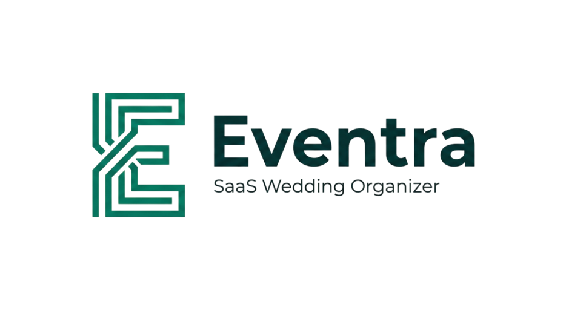

<p align="center">
  
</p>

<h1 align="center">WO Manager</h1>

<p align="center">
  <strong>Sistem Manajemen Wedding Organizer Premium & Berbasis Data.</strong>
</p>

<p align="center">
  
  
  
  
</p>

---

## 🚀 Ikhtisar Sistem

**WO Manager** adalah solusi bagi Wedding Organizer profesional untuk mengelola seluruh operasional bisnis dalam satu platform terintegrasi. Dirancang dengan estetika premium yang bersih dan alur kerja yang efisien, sistem ini membantu Anda fokus pada pelestarian momen bahagia klien Anda sementara kami menangani detail teknisnya.

## ✨ Fitur Unggulan

### 📊 Dashboard Analitik Real-time

Visualisasikan kesehatan bisnis Anda secara instan.

- **Grafik Cashflow Dinamis**: Menggunakan Chart.js untuk memantau arus kas 6 bulan terakhir.
- **Metrik Utama**: Pantau total pendapatan, piutang, invoice belum terbayar, dan klien baru secara langsung.
- **Log Aktivitas**: Pantau invoice terbaru dan riwayat pembayaran dalam satu tampilan.

### 👥 Manajemen Klien & Paket

- **Database Klien Terpusat**: Simpan detail calon pengantin, jadwal acara, dan riwayat interaksi.
- **Configurator Paket**: Buat dan kelola paket layanan wedding yang fleksibel dan mudah disesuaikan.

### 📜 Sistem Invoice & Ledger Kreatif

- **Pembuatan Invoice Profesional**: Desain eksklusif yang bisa diedit dan dicetak langsung.
- **Pelacakan DP (Down Payment)**: Sistem otomatis merekam uang muka dan menjumlahkannya ke dalam laporan omzet harian.
- **Ledger Transparansi**: Lihat setiap sen yang masuk mulai dari setoran awal hingga pelunasan akhir.

### 🔒 Keamanan & Performa

- **Laravel Sanctum Auth**: Autentikasi modern dan aman.
- **High-Fidelity UI**: Penggunaan Glassmorphism, Emerald Design System, dan navigasi yang sangat responsif.

---

## 🛠️ Stack Teknologi

- **Backend**: Laravel 11 (PHP 8.2+)
- **Frontend**: Vue.js 3 (Composition API)
- **State Management**: Pinia
- **Styling**: TailwindCSS
- **Database**: PostgreSQL / MySQL
- **Charts**: Chart.js & vue-chartjs
- **Tooling**: Vite, Axios, Lucide Icons

---

## ⚙️ Cara Instalasi

Ikuti langkah-langkah berikut untuk menjalankan WO Manager di lingkungan lokal Anda:

### 1. Klon Repositori

```bash
git clone https://github.com/yourusername/wo-manager.git
cd wo-manager
```

### 2. Instalasi Dependensi Backend

```bash
composer install
```

### 3. Instalasi Dependensi Frontend

```bash
npm install
```

### 4. Konfigurasi Environment

Salin file `.env.example` menjadi `.env` dan sesuaikan pengaturan database Anda:

```bash
cp .env.example .env
php artisan key:generate
```

### 5. Migrasi & Seeding

```bash
php artisan migrate --seed
```

### 6. Jalankan Server

Buka dua terminal dan jalankan perintah berikut:

**Terminal 1 (Backend):**

```bash
php artisan serve
```

**Terminal 2 (Frontend):**

```bash
npm run dev
```

---

## 📁 Struktur Proyek

- `app/Services`: Logika bisnis utama (InvoiceService, DashboardService).
- `resources/js/views`: Halaman utama aplikasi (Dashboard, Clients, Invoices).
- `resources/js/stores`: Manajemen state menggunakan Pinia.
- `resources/js/components/ui`: Komponen UI premium yang dapat digunakan kembali.

---

<p align="center">
  Developed with ❤️ for Wedding Professionals.
</p>
